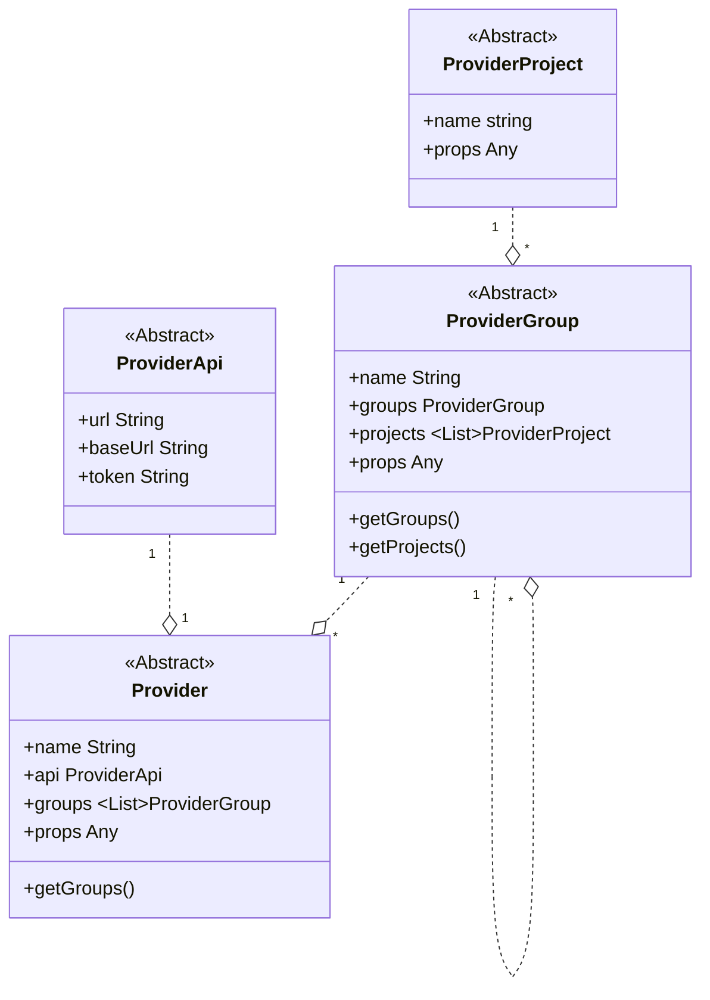

# Conception

Below is a simple conception schematic for the class project.

```mermaid
classDiagram
  class Provider{
    <<Abstract>>
    +name String
    +api ProviderApi
    +groups ~List~ProviderGroup
    +props Any
    +getGroups()
  }

  class ProviderApi{
    <<Abstract>>
    +url String
    +baseUrl String
    +token String
  }

  class ProviderGroup{
    <<Abstract>>
    +name String
    +groups ProviderGroup
    +projects ~List~ProviderProject
    +props Any
    +getGroups()
    +getProjects()
  }

  class ProviderProject {
    <<Abstract>>
    +name string
    +props Any
  }

  ProviderGroup "1" ..o "*" Provider
  ProviderApi "1" ..o "1" Provider
  ProviderGroup "1" ..o "*" ProviderGroup
  ProviderProject "1" ..o "*" ProviderGroup
```
