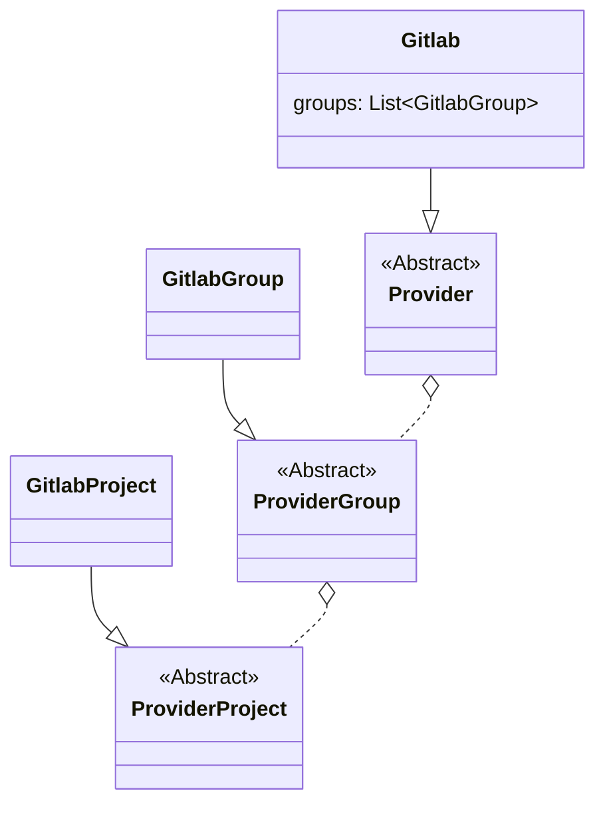

```mermaid
classDiagram
  class ProviderProject {
    <<Abstract>>
  }
  class GitlabProject {
  }

  class ProviderGroup{
    <<Abstract>>
  }
  class GitlabGroup{
  }

  class Provider{
    <<Abstract>>
  }
  class Gitlab{
    groups: List~GitlabGroup~
  }

  Gitlab --|> Provider
  GitlabGroup --|> ProviderGroup
  GitlabProject --|> ProviderProject
  Provider o.. ProviderGroup
  ProviderGroup o.. ProviderProject

```
